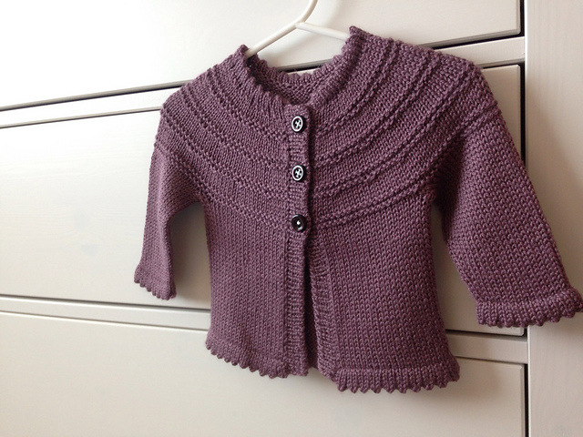

# Siliki: See it, Like it, Knit it {#SILIKI}

#### Keywords {-}

what's that stitch, knit, pattern creator, garment, sweater, scarf, hat, mittens, pattern

## What's that pattern?

You see a knit garment that you must make, but without a knitting pattern*, it is difficult to recreate. For knitters, this can happen any time, anywhere. There exists an unbelievably large number of knitting patterns dispersed in knitting magazines, books, blogs, or aggregated on Ravelry. Ravelry, a social network for knitters and knitting pattern database, has been gaining membership steadily since its founding in 2007 [@noauthor_how_2009] and is currently at 7.6 million registered accounts. However, there are many garments that do not have patterns because they are commercially made, designed by a single knitter with sparse notes on loose paper, or many other reasons.  Sometimes, a knitter spots an item at the bus stop, in a movie, or elsewhere in the wild, and wishes to recreate it, but cannot find the pattern. A talented designer can, of course, reverse engineer most objects. However, Siliki (see it, like it, knit it) aids the knitter by automating the process of designing a knit object from a photograph.      

Siliki takes an image of a knit garment as input, identifies the garment, stitch pattern(s), and gauge. As an intermediate output, Siliki determines which measurements are required for the particular garment. The user inputs the required measurements, and Siliki produces a custom pattern to recreate the garment.

Siliki will provide knitters with knitting patterns to recreate any garment from an image! 

## Here, have a pattern!

How would a knitter recreate a garment if no pattern exists? There are many questions to answer.  First, we must answer the obvious questions about number of stitches and stitch patterns, then the less obvious questions about best construction techniques, and then the artistic questions about the best shaping techniques for the drape of specific yarns.


<!-- You can include images saved within your repo... -->
```{r Cardigan_1,echo=FALSE,fig.cap='An adorable baby cardigan knit by Alla',fig.align='center',out.width='50%'}

```

<!-- You can include images saved within your repo... -->
```{r Cardigan_2,echo=FALSE,fig.cap='Another equally adorable baby cardigan knit by Alla',fig.align='center',out.width='50%'}
knitr::include_graphics('img/Cardigan_2.jpg')
```
From a user submitted photograph, like the examples above, Siliki uses image recognition along with machine learning to identify the type of garment, stitch pattern(s), gauge, and suggested yarn.** Once Siliki knows the type of garment, it can identify the most likely construction. The critical measurements required are based on the construction of the garment.  For example, a cardigan with raglan sleeves will require a bust size, length, and desired ease, while a hat would require a head circumference. 

<!-- You can include images saved within your repo... -->
```{r Baby_Pants,echo=FALSE,fig.cap='An example of an easy to reverse engineer image',fig.align='center',out.width='50%'}
knitr::include_graphics('img/Baby_Pants.jpg')
```

<!-- You can include images saved within your repo... -->
```{r Baby_Pants_2,echo=FALSE,fig.cap='An example of a difficult to reverse engineer image',fig.align='center',out.width='50%'}
knitr::include_graphics('img/Baby_Pants_2.jpg')
```
Siliki identifies the stitch patterns on the garment based on a machine learning algorithm trained on images from Ravelry's pattern and project database.  Ravelry currently contains more than 740 thousand knit and crochet patterns and 17.5 million knit and crochet projects, most with multiple images.  Several examples of different images of the same cute baby pants are shown above.  The challenge here will be to train the algorithm sufficiently such that it recognizes images of the stitch patterns in various yarns, colors, guages, and in very different lighting situations.  For very complex stitch patterns that are extremely difficult to decipher (e.g. complex and novel lace), Siliki will default to a close, but simpler match.

Once Siliki identifies the type of garment, the stitch patterns, the gauge, and receives the measurements from the user, a pattern can be built following proportional calculations for stitch counts and shaping. Some machine learning will be required here to account for the best shaping methods.  Siliki will synthesize all of the output to create a beautifully formatted custom pattern. The pattern will contain information on needle sizes and recommended yarns based on suitability and popularity on Ravelry.  Additionally, Siliki will output patterns that are similar to what the user is trying to create.  If Ravelry contains a pattern for a very close match, a link to that pattern will be returned, with the option to purchase it or create the pattern.  If the image submitted is one of the images included in an existing pattern, Siliki will not provide a pattern, but only the purchase option.

If there are errors in the pattern that can be fixed by the user, they may be uploaded to Siliki's website to inform future patterns.  If the user needs help, Siliki will have talented knitwear designers to provide a fix to the user and the database.

Patterns created utilizing Siliki will be copyrighted to Siliki.  All copyright laws will apply.[@noauthor_matter_nodate]

## Let's knit!

Now that the user has a pattern, the knitting is up to them. Creation of the garment is still as much of an art as following any other pattern.  The knitter selects the yarn, executes the swatching, knitting, piecing, finishing, and blocking. But the frustrating pattern search for a specific item disappears.  

While the ability to obtain a pattern for any garment opens up doors for users, it complicates the current knitwear design ecosystem.  Currently, knitwear design is an artform.  Designers pour significant effort into creating and publishing patterns.  Some designers even depend on sales of their patterns for their livelihood. Something like Siliki, though not infringing on copyright, would open the door for copycat designs that may jeopardize these sales. Designers may respond negatively by reducing the number of photos in their patterns, or otherwise modify the patterns to reduce the effectiveness of Siliki.  Alternatively, designers may respond positively and choose to partner with Siliki.


* For non-knitters, a knitting pattern is a construction recipe for a garment.

** Suggested yarns could be sponsored, leading to a potential additional revenue stream.